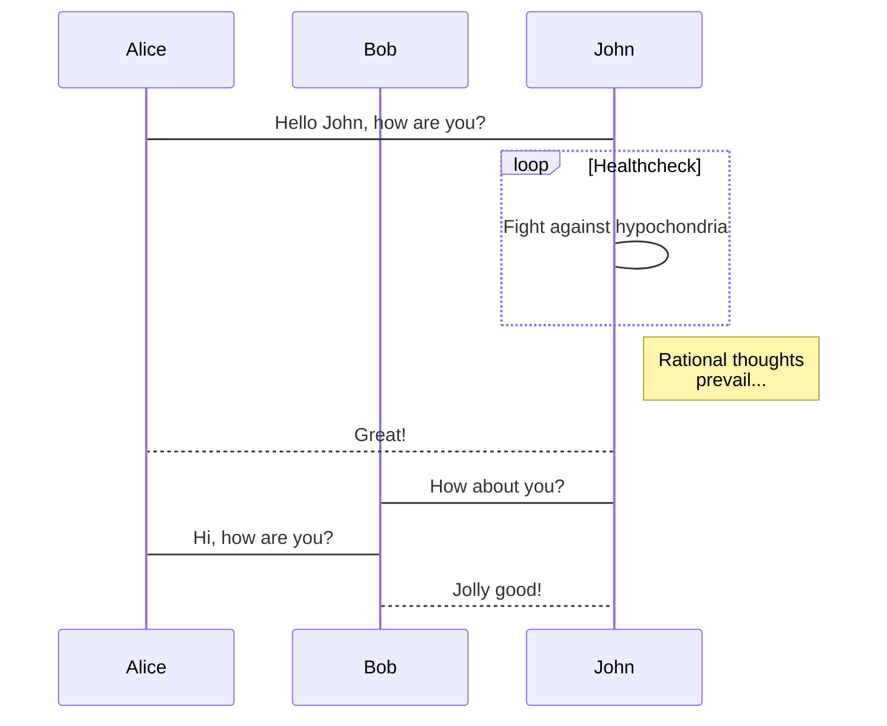
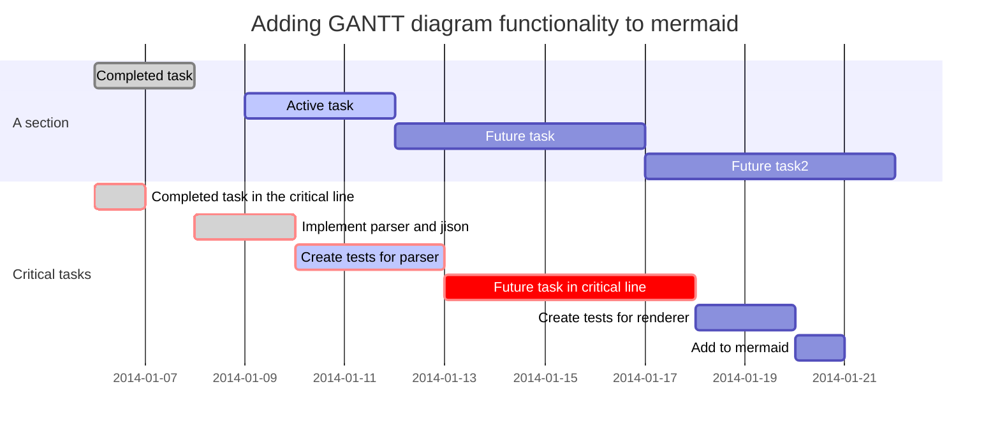
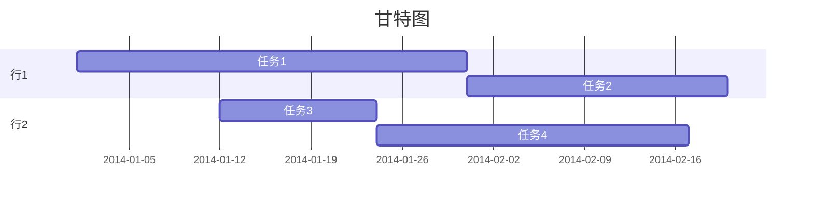
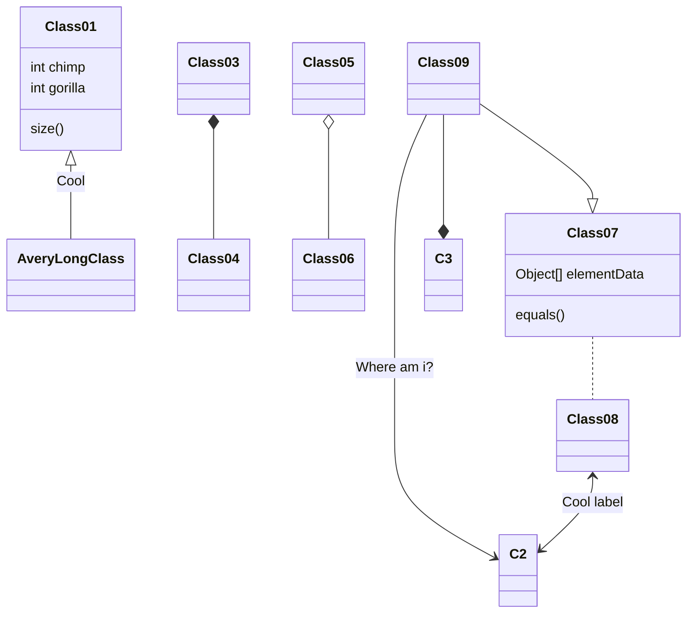

# everwork的自说明文档

## 把evernote作为信息存储收集和展示发布平台的工作平台

### 志在千里

### 天天向上

- *微操作构建天堂*
- *勤练脑改善生活*

---

#### 流程图

```flow
    //定义类型和描述
    st=>start: 开始
    e=>end: 结束
    op=>operation: 测试
    cond=>condition: 无误？

    st->op->cond
    cond(yes)->e
    cond(no)->op
```

```python
## 操作块(格式为:变量=>操作块: 备注名)
st=> start: 开始
e=>end: 结束
#普通操作块 opration
op1=>opration: 第一个操作块
op2=>opration: 第二个操作块
#判断块 condition
cond1=>condition: 第一个判断
cond2=>condition: 第二个判断
  
#输入输出块 inputoutput[平行四边形]
io1=>inputoutput: 输入输出块1
io2=>inputoutput: 输入输出块2
#子任务块
sub1=>subroutine: 子任务1
sub2=>subroutine: 子任务2
  
## 判断和位置控制
#判断流程控制
cond1(yes)->op1  #yes 的时候回到 op1
cond1(no)->e   #no 的时候 去结束
  
#位置指定
cond1(no)->op2(right)->op1 #控制 op2 位置置于右边，再由op2 返回 op1 (好像不能向左)
#还可以这样 cond1(no,right)
cond1(yes)->e

## 流程控制
#分着写
st->op1
op1->e
  
#合着写
st->op1->e
  
#判断也是一样：
st->cond
cond(yes)->io
cond(no)->op1
```

```flow
    st=>start: 鉴权
    e=>end: 结束退出
    cond1=>condition: user==bgbiao
    product=ddaotian
    productcheck=>condition: ddaotian类型产品库存
    (ecs,bss,vpc,eip,hids)

    op1=>operation: 发起预订请求
    拆单并库存检测

    op2=>operation: info:生产指定类型产品
    (DAOTIAN:ecs,natip,eip,hids)
    op3=>operation: 鉴权失败
    op4=>operation: 库存检测失败

    io1=>inputoutput: 返回产品相关信息
    ECS,NATIP,EIP,HIDS

    io2=>inputoutput: info:无此类型产品

    st->cond1
    cond1(yes)->op1->productcheck(yes)->op2->io1->e
    cond1(no)->op3->e
    cond1(yes)->op1->productcheck(no)->op4->io2->e
```

### 时序图

```sequence {theme="hand"}
    bgbiao-> bianbian: good morning
    note left of bgbiao: man
    bianbian -> bgbiao: eat something
    note right of bianbian: woman

    note over bgbiao: test

```

#### 流程图 under mermaid


#### 时序图 under mermaid



#### mermaid甘特图



#### mermaid甘特图1



#### mermaid类图

可以看到大部分类关系（如聚合、继承）的显示都有问题，所以并不适合用于描述类与类之间的关系。


